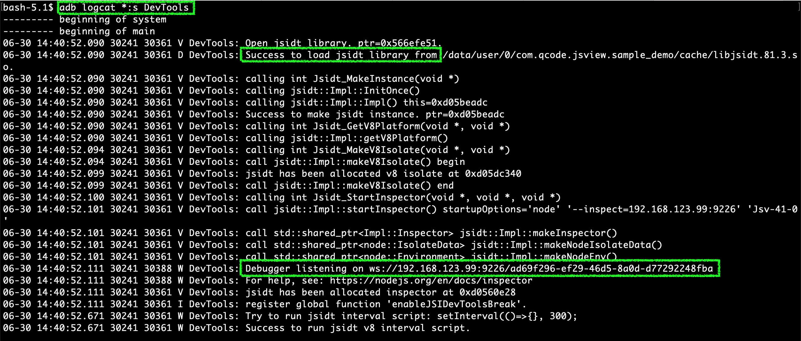
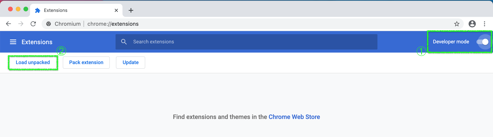
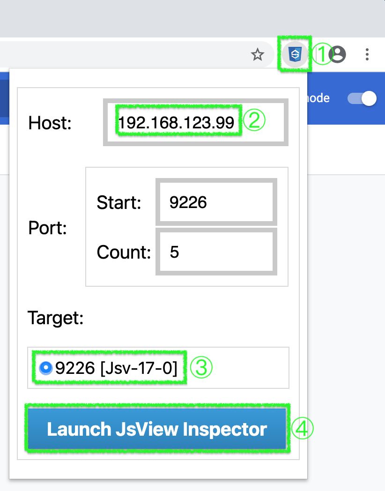
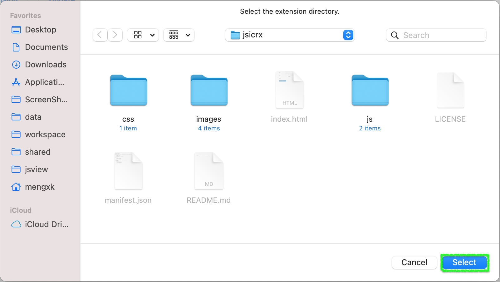
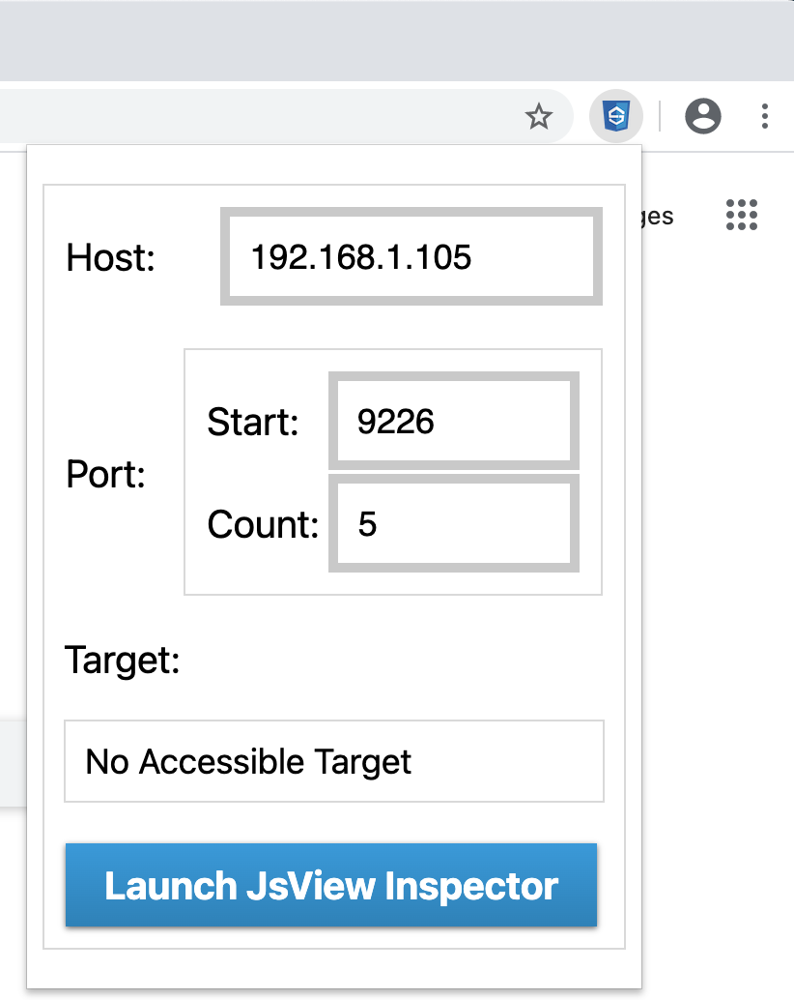
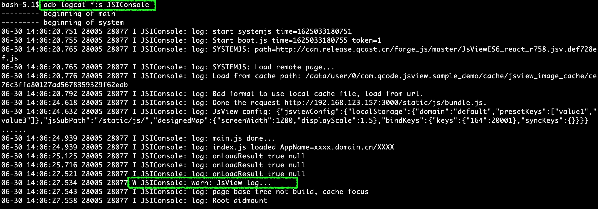

# 1. Apk功能介绍

本apk用于加载、展示，使用<**bee-design 组件库**>开发的高性能页面。  
本apk仅用于demo使用，请勿部署到生产环境。 

---

# 2. Apk的安装、启动、调试
## 2.1 Apk安装

+  1)apk的下载地址  
[下载地址](http://192.168.1.3/demo.apk)    

---

+  2)apk的运行环境  
硬件：Android机顶盒  
系统版本：4.4.2及以上版本  

---

+ 3)apk的安装：  
对于开发人员，请使用[adb工具](adb-tools.zip)将apk安装进机顶盒。 
```sh
    adb install -r -d xxx.apk  
```

---

## 2.2 Apk启动

+  1)apk安装成功后，可以在机顶盒的应用列表中看到apk的应用图标，如下：  
   
可以通过点击图标，直接启动apk，此时apk将加载、展示内置的demo页面地址。  

---

+  2)若在机顶盒的应用列表中找不到apk的图标入口，则可以通过adb命令直接拉起apk：   
```sh
    adb shell am start -a bestv.epg.action.vis com.bestv.epg.vis  
```

---

+  3)加载自己开发的页面，例如：`http://192.168.1.3/main.jsv.js`  
```sh
    adb shell am start -a bestv.epg.action.vis --es epgUrl "http://192.168.1.3/main.jsv.js" com.bestv.epg.vis  
```

---

## 2.3 Android机顶盒页面调试

提示  

> 当你在网页端开发完成主要功能后，就需要将网页运行在Android端，进行细调或其他功能开发。另外，程序最终是运行在Android设备上的，当运行过程中出现 Bug 或其他问题，有一个友好的调试方法将事半功倍的解决问题。

### 2.3.1 打开DevTools

为了减少差异化，断点调试可以使用Chromium+插件方式。因为需要连通Android设备和浏览器，并优先考虑运行时指标，整个搭建过程略显复杂，这需要您的耐心。一旦搭建成功，使用时和浏览器调试已经没有太大区别。

+   1)推送调试包 libjsidt 到Android设备。
    
    下载[libjsidt.102.1.so (opens new window)](https://cdn.release.qcast.cn/RN_devtools/core-102-tools/libjsidt.102.1.so)  到本地后 ，通过adb推送到Android设备的/data/local/tmp/文件夹。  
    例如：`adb push libjsidt.102.1.so /data/local/tmp/libjsidt.102.1.so`.
    
    注意: adb push 时，目标地址 /data/local/tmp/libjsidt.XX.X.so 要写全路径，window系统可能会出现会略.so后缀的问题发生
    
+   2)重启Android程序，通过 `adb logcat *:s DevTools` 看到 *Debugger listening on ws://* 字样时，说明调试包成功加载，Android端的准备工作就完成了。
    
    
+   3)安装Chromium和插件  

    (1)安装特定版本的chrome  
    [windows](http://cdn.release.qcast.cn/RN_devtools/Chromium-102.0.4983.1-Windows-x64.zip)   
    [macos_x64](http://cdn.release.qcast.cn/RN_devtools/Chromium-102.0.4996.1-Macosx-x64.zip)  
    [macos-arm64](http://cdn.release.qcast.cn/RN_devtools/Chromium-102.0.4995.1-Macosx-arm64.zip)  

    ---
    (2)安装V8 Inspector插件  
    a、下载[插件](https://release-pool.oss-cn-qingdao.aliyuncs.com/RN_devtools/core-102-tools/jsicrx.102.1.zip),下载后进行解压到你喜欢的位置。  
    b、在Chromium的地址栏输入：chrome://extensions/，然后打开“开发者模式”①，选择“加载已解压的扩展程序”②。

    

    
+   4)打开 JsView V8 Inspector 插件①，输入Android设备的ip②和端口(默认9226)扫描范围，等待扫描结果后选择可调式端口③，点击进入④。
    
      

    选择上个步骤解压zip出来的目录。

    

    打开插件，可以看到如图界面

    

### 2.3.2 Log跟踪(console.log)

你可以选择一下两种方式中的任意一种查看 console log。

+   命令行方式：通过adb，命令行输入`adb logcat *:s JSIConsole` 跟踪log打印。



+   Chromium方式：打开**DevTools**，在 DevTools 中选择"Console"。即可看到console.log打印。  

---


更加详细详细的调试说明，请 [参考](http://jsview-dev.shijiutv.com/guide/3.dev&debug/3.3.devtools-on-android.html#_1-%E6%89%93%E5%BC%80devtools)  

